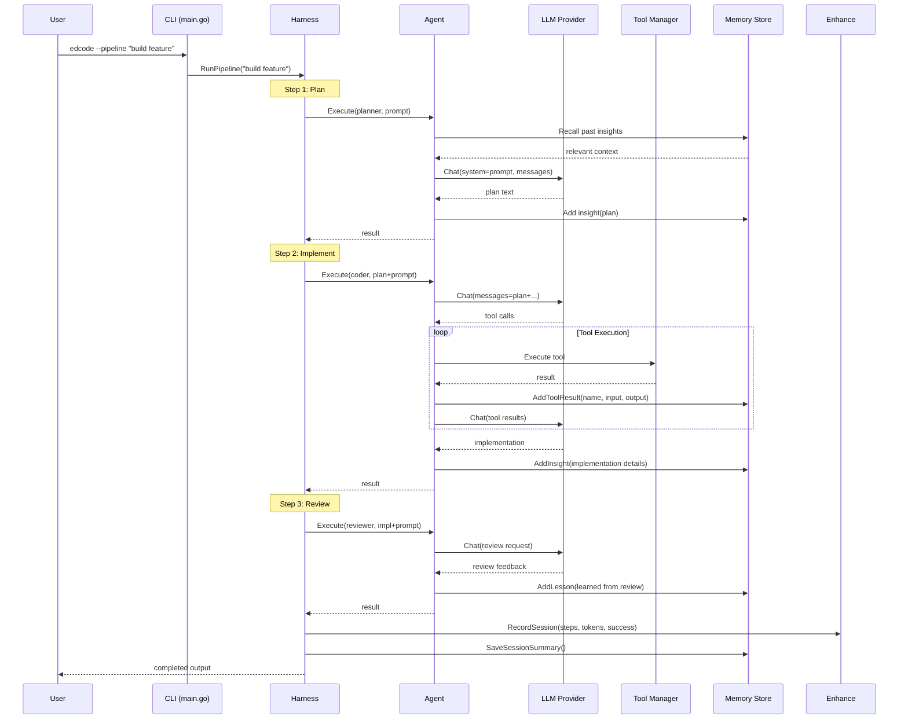
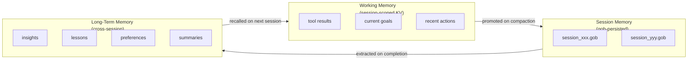
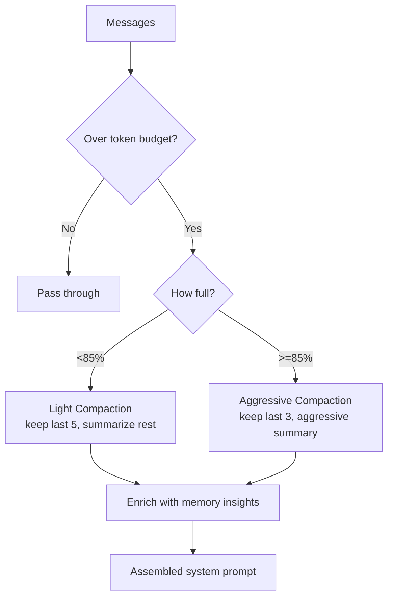
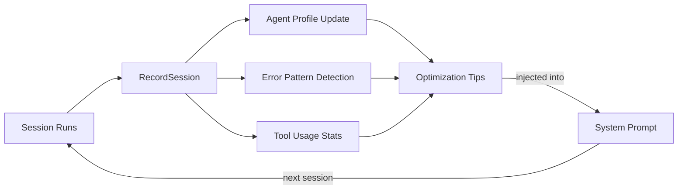

# Edcode

```
________  _______          ______    ______   _______   ________
|        \|       \        /      \  /      \ |       \ |        \
| $$$$$$$$| $$$$$$$\      |  $$$$$$\|  $$$$$$\| $$$$$$$\| $$$$$$$$
| $$__    | $$  | $$      | $$   \$$| $$  | $$| $$  | $$| $$
| $$  \   | $$  | $$      | $$      | $$  | $$| $$  | $$| $$  \
| $$$$$   | $$  | $$      | $$   __ | $$  | $$| $$  | $$| $$$$$
| $$_____ | $$__/ $$      | $$__/  \| $$__/ $$| $$__/ $$| $$_____
| $$     \| $$    $$       \$$    $$ \$$    $$| $$    $$| $$     \
 \$$$$$$$$ \$$$$$$$         \$$$$$$   \$$$$$$  \$$$$$$$  \$$$$$$$
```

your AI agent harness

A modular, pluggable AI agent harness in Go with multi-model routing, pipeline execution, MCP tool integration, persistent memory, context compaction, and auto-enhancement.

## Architecture

```mermaid
flowchart TB
    CLI[CLI Entrypoint<br/>cmd/edcode/main.go] --> H[App<br/>internal/app/app.go]

    subgraph App["App Orchestrator"]
        H --> REG[Provider Registry<br/>internal/provider/registry.go]
        H --> SM[Session Manager<br/>internal/session/session.go]
        H --> MM[Memory Store<br/>internal/memory/memory.go]
        H --> CM[Context Manager<br/>internal/ctxmgr/manager.go]
        H --> EE[Enhance Engine<br/>internal/enhance/enhance.go]
        H --> MW[Middleware Chain<br/>internal/middleware/middleware.go]
    end
    
    subgraph Agents["Agent System"]
        H --> AG[EnhancedAgent<br/>internal/agent/agent_v2.go]
        AG --> TM[Tool Manager<br/>internal/tool/interface.go]
    end
    
    subgraph Providers["Model Providers"]
        REG --> OA[OpenAI Provider<br/>internal/provider/openai.go]
        REG --> AN[Anthropic Provider<br/>internal/provider/anthropic.go]
        REG --> FACT[Factory<br/>internal/provider/factory.go]
    end
    
    subgraph Tools["Tool System"]
        TM --> READ[read tool]
        TM --> WRITE[write tool]
        TM --> EDIT[edit tool]
        TM --> BASH[bash tool]
        TM --> GLOB[glob tool]
        TM --> GREP[grep tool]
        TM --> WEB[web tool]
        TM --> MCP[MCP Client<br/>internal/tool/mcp/client.go]
    end
    
    subgraph MCP["MCP Ecosystem"]
        MCP --> CG[CodeGraph MCP<br/>codebase knowledge graph]
        MCP --> CS[Custom MCP Servers<br/>filesystem, git, etc.]
    end
    
    subgraph MemorySystem["Memory & Learning"]
        MM --> WORK[Working Memory<br/>session-scoped KV]
        MM --> SESSION[Session Memory<br/>gob-persisted per run]
        MM --> LONG[Long-Term Memory<br/>insights, lessons, summaries]
        EE --> PROFILE[Agent Profile<br/>usage stats, success rates]
        EE --> INSIGHTS[Auto-Insights<br/>optimization tips]
    end
    
    subgraph Context["Context Management"]
        CM --> SLIDING[Sliding Window<br/>token-budget aware]
        CM --> COMPACT[Compaction<br/>light & aggressive modes]
        CM --> SUMMARIZE[Summarization<br/>head->summary, keep tail]
        CM --> ENRICH[Memory Enrichment<br/>past insights->system prompt]
    end
    
    CLI --> |--pipeline| PIPELINE[Pipeline Execution<br/>plan -> implement -> review]
    CLI --> |--switch-model| SWITCH[Dynamic Model Switching]
```



## Quick Start

### Prerequisites

- Go 1.22+
- API keys for your chosen providers (set as environment variables)

### Installation

```bash
git clone <repo> && cd edcode
go build -o edcode ./cmd/edcode/
./edcode --init
```

### Configuration

`edcode.yaml` is auto-generated by `--init`. Edit it to customize:

```yaml
providers:
  openai:
    base_url: https://api.openai.com/v1
    default_model: gpt-4o
    models:
      - id: gpt-4o
        name: GPT-4o
        context_length: 128000
        output_length: 16384
      - id: gpt-4o-mini
        name: GPT-4o Mini
        context_length: 128000
        output_length: 16384
  anthropic:
    base_url: https://api.anthropic.com/v1
    default_model: claude-sonnet-4-20250514
    models:
      - id: claude-sonnet-4-20250514
        name: Claude Sonnet 4
        context_length: 200000
        output_length: 8192
  openrouter:
    base_url: https://openrouter.ai/api/v1
    default_model: anthropic/claude-sonnet-4-20250514
  ollama:
    base_url: http://localhost:11434/v1
    default_model: llama3

agents:
  default:
    description: Default agent with full tool access
    model: openai/gpt-4o
    max_steps: 25
    temperature: 0.7
    tools: [read, write, edit, bash, glob, grep, web]
    permission:
      read: allow
      write: allow
      edit: allow
      bash: ask
      glob: allow
      grep: allow
      web: allow
  planner:
    description: Analyzes tasks and produces a plan
    model: openai/gpt-4o
    max_steps: 10
    temperature: 0.3
    tools: [read, glob, grep]
    permission:
      read: allow
      write: deny
      edit: deny
      bash: deny
      glob: allow
      grep: allow
      web: allow
  coder:
    description: Writes and edits code
    model: openai/gpt-4o
    max_steps: 30
    temperature: 0.2
    tools: [read, write, edit, bash, glob, grep]
    permission:
      read: allow
      write: allow
      edit: allow
      bash: allow
      glob: allow
      grep: allow
      web: deny
  reviewer:
    description: Reviews changes for correctness and quality
    model: openai/gpt-4o
    max_steps: 10
    temperature: 0.1
    tools: [read, glob, grep, bash]
    permission:
      read: allow
      write: deny
      edit: deny
      bash: allow
      glob: allow
      grep: allow
      web: deny

pipeline:
  steps:
    - name: plan
      agent: planner
      prompt: "Analyze the request and create a detailed implementation plan."
    - name: implement
      agent: coder
      prompt: "Implement the plan step by step, writing all necessary code."
    - name: review
      agent: reviewer
      prompt: "Review all changes for correctness, quality, and edge cases."

mcp:
  codegraph:
    enabled: false
    type: local
    command: npx
    args: ["-y", "@colbymchenry/codegraph", "serve", "--mcp"]

session:
  max_tokens: 200000
  auto_compact: true
  max_messages: 50
```

## Usage Examples

### Basic Execution

```bash
# Run with default agent (openai/gpt-4o)
./edcode "explain the architecture of this project"

# Run with a specific agent
./edcode --agent planner "analyze the codebase structure"

# Override model for the session
./edcode --model anthropic/claude-sonnet-4-20250514 "refactor the auth module"
```

### Pipeline Mode

```bash
# Run plan -> implement -> review pipeline
./edcode --pipeline "build a REST API for user management"
```

### Dynamic Model Switching

```bash
# Switch default agent to Claude
./edcode --switch-model anthropic/claude-sonnet-4-20250514

# Switch to GPT-4o Mini (cheaper for simple tasks)
./edcode --switch-model openai/gpt-4o-mini

# Switch to local Ollama model
./edcode --switch-model ollama/llama3

# List available models
./edcode --list-models
```

### CodeGraph Integration

```yaml
# Enable in edcode.yaml
mcp:
  codegraph:
    enabled: true
    type: local
    command: npx
    args: ["-y", "@colbymchenry/codegraph", "serve", "--mcp"]
```

CodeGraph gives agents instant structural queries (`codegraph_search`, `codegraph_trace`, `codegraph_impact`, `codegraph_context`) — reducing tool calls by ~62% and tokens by ~57%.

## Pipeline Flow



## Memory System

Three-tier memory architecture:



### Memory Types

| Type | Scope | Persistence | Content |
|------|-------|-------------|---------|
| **Working** | Single session | In-memory only | Tool results, recent actions, current goals |
| **Session** | One run | Gob file (`.edcode/memory/session_xxx.gob`) | Full session history, tool calls, results |
| **Long-Term** | Cross-session | Gob files in `.edcode/memory/` | Insights, lessons, preferences, summaries |

### Memory API

```go
// Remember something for the session
memory.Remember(memory.LevelSession, "Architecture decision: use PostgreSQL", "decision", []string{"architecture", "database"})

// Store a lesson learned
memory.AddLesson("Always test file writes in temp directory first", []string{"best-practice", "testing"})

// Add an insight about the codebase
memory.AddInsight("The auth module uses middleware pattern with JWT tokens", []string{"auth", "jwt", "middleware"})

// Recall relevant memories
results := memory.Recall("database configuration")

// Get working context for system prompt
ctx := memory.WorkingContext()
instructions := memory.GetInstructions()
```

## Context Management



### Compaction Modes

| Mode | Trigger | Behavior |
|------|---------|----------|
| **Light** | 80%+ of token budget | Keep last 5 messages verbatim, summarize older messages |
| **Aggressive** | 85%+ of token budget | Keep last 3 messages verbatim, aggressive summarization |
| **None** | Manual | No compaction — pass messages through unchanged |

### Context API

```go
// Auto-compact when needed
cr := contextMgr.AutoCompact(messages, false)
if cr.Compacted {
    log.Printf("compacted: saved %d tokens", cr.TokensSaved)
}

// Enrich system prompt with past memories
prompt := contextMgr.EnrichWithMemory("You are a helpful assistant.")
// Result: "You are a helpful assistant.\n\n## Context from Past Sessions\n- [insight] ... \n\n## Learned Instructions\n- ..."
```

## Auto-Enhancement

The harness learns from every session:

- **Tracks**: tool usage frequency, success rates, average steps per task
- **Records**: error patterns, agent performance per model
- **Suggests**: optimal model based on historical success rates
- **Generates**: per-agent optimization tips injected into system prompts
- **Accumulates**: cross-session insights that compound over time



### Enhancement API

```go
// Record a completed session
enhancer.RecordSession(enhance.SessionRecord{
    ID: "ses_123", Agent: "coder",
    Steps: 15, ToolCalls: 8, Success: true,
    Tokens: 45000, Errors: []string{},
})

// Get optimization tips for an agent
tips := enhancer.GetOptimizations("coder")
// ["Tip: Agent 'coder' averages 22 steps. Break tasks into smaller pieces."]

// Auto-enhance system prompt
prompt := enhancer.AutoEnhanceSystemPrompt("You are a helpful assistant.", "default")
```

## Features

### Multi-Model Support

Switch models at runtime — OpenAI, Anthropic, OpenRouter, Ollama, or any OpenAI-compatible API:

```bash
./edcode --switch-model anthropic/claude-sonnet-4-20250514
./edcode --switch-model openai/gpt-4o
./edcode --switch-model ollama/llama3
```

### Pipeline Execution

Run a multi-step pipeline (plan -> implement -> review) with different agents per step:

```bash
./edcode --pipeline "build a REST API for user management"
```

### Built-in Tools

| Tool | Description |
|------|-------------|
| `read` | Read files with offset/limit |
| `write` | Create/overwrite files |
| `edit` | Exact string replacement |
| `bash` | Execute shell commands |
| `glob` | Find files by pattern |
| `grep` | Regex search via ripgrep |
| `web` | Fetch URLs |

### MCP Tool Integration

Connect any MCP server. Tools are auto-discovered and namespaced:

```yaml
mcp:
  codegraph:
    enabled: true
    type: local
    command: npx
    args: ["-y", "@colbymchenry/codegraph", "serve", "--mcp"]
  filesystem:
    enabled: true
    type: local
    command: npx
    args: ["-y", "@modelcontextprotocol/server-filesystem", "."]
```

## Project Structure

```
edcode/
├── cmd/edcode/main.go        # CLI entrypoint
├── internal/
│   ├── agent/
│   │   ├── agent.go           # Base agent loop
│   │   └── agent_v2.go        # Enhanced agent (memory + learning)
│   ├── config/config.go       # YAML config with defaults
│   ├── provider/
│   │   ├── interface.go       # Provider abstraction
│   │   ├── registry.go        # provider/model routing
│   │   ├── openai.go          # OpenAI + compatible APIs
│   │   ├── anthropic.go       # Anthropic Claude API
│   │   └── factory.go         # Config->Provider factory
│   ├── tool/
│   │   ├── interface.go       # Tool + permission system
│   │   ├── builtin.go         # 7 built-in tools
│   │   └── mcp/client.go      # MCP client (JSON-RPC 2.0)
│   ├── middleware/middleware.go  # Lifecycle hooks
│   ├── session/session.go     # Session management
│   ├── memory/memory.go       # 3-tier memory store
│   ├── ctxmgr/manager.go      # Context compaction + summarization
│   ├── enhance/enhance.go     # Auto-enhancement engine
│   └── app/app.go             # Top-level orchestrator
├── edcode.yaml               # Configuration
├── go.mod / go.sum
└── README.md
```

## Extending

### Add a Provider

Implement the `Provider` interface:

```go
type MyProvider struct{}

func (p *MyProvider) Name() string { return "myprovider" }
func (p *MyProvider) Chat(ctx, req) (*ChatResponse, error) { ... }
func (p *MyProvider) ChatStream(ctx, req) (StreamReader, error) { ... }
func (p *MyProvider) Models() []ModelInfo { ... }
func (p *MyProvider) Supports(modelID string) bool { ... }
```

### Add a Tool

```go
type MyTool struct{}
func (t *MyTool) Name() string { return "my_tool" }
func (t *MyTool) Description() string { return "Does something useful" }
func (t *MyTool) InputSchema() provider.InputSchema { ... }
func (t *MyTool) Execute(ctx, args, toolCtx) *Result { ... }
```

Register: `toolMgr.Register(&MyTool{})` in app init.

### Add Middleware

```go
import "github.com/edmundo/edcode/internal/middleware"

mw.AddPreModel(func(ctx, mwCtx, req) (*provider.ChatRequest, error) {
    req.Temperature = 0.1 // override for this agent
    return req, nil
})
```

### Add a Skill

Skills are reusable instruction sets stored as `SKILL.md` files. The agent loads them on-demand via the `skill` tool.

**Directory structure:**
```
project/
├── .skills/
│   ├── SKILL.md          # Default skill location
│   └── code-review/
│       └── SKILL.md      # Nested skill
├── skills/               # Alternative location
└── edcode.yaml
```

**SKILL.md format:**
```markdown
# Code Review

A reusable skill for performing thorough code reviews.

## Description
- A structured approach to reviewing code changes for correctness, security, and quality

## Allowed Tools
- read
- grep
- glob
- bash

## Procedure

1. Read the diff or changed files to understand what changed
2. For each file, check:
   - Correctness: Does the logic handle edge cases?
   - Security: Are there injection vulnerabilities?
   - Performance: Are there obvious performance issues?
3. Run tests to verify the changes work
4. Summarize findings with severity levels
```

**Usage inside agent prompts:**
```bash
# The agent will discover available skills automatically
./edcode "review the changes in this PR"

# Agent can call the skill tool internally:
# skill list  → see available skills
# skill load code-review  → load instructions
# skill unload code-review  → unload when done
```

**List skills from CLI:**
```bash
./edcode --list-skills
```

**Skills are automatically:**
- Discovered in `.skills/`, `skills/`, and `~/.edcode/skills/`
- Listed in the system prompt so the agent knows what's available
- Injected into the system prompt when loaded (merged with memory insights and auto-enhancement tips)
- Persisted as loaded/unloaded state across the session

## License

MIT

---

*Built from research on opencode, LangChain, LiteLLM, AutoGPT, and MCP architectures.*
